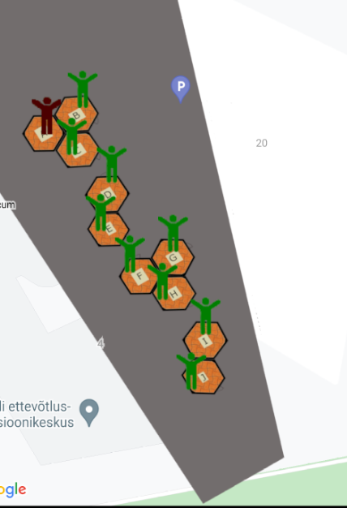
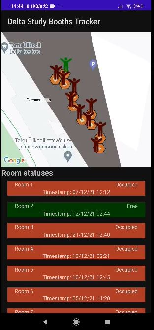

<!-- PROJECT LOGO -->
 

  <h3 align="center">
2021 MCIoT Delta Study Booths Tracker</h3>

  

 Final work for 2021 MCIoT course
  

<!-- ABOUT THE PROJECT -->
## About The Project
Delta Study Booth Tracker is an app for anyone who uses delta study booths. You can see whether a booth is occupied from our simple to use app. The booths are tracked via a ultra-sonic sensor and also have a LED light to indicate visually, without the app, if the booth is full or not. 

The app has a scrollable list of the study booths, as well as a visual map.

The map and list. Green is empty, red is full. The men on the map as well as the list indicate whether a booth is full or not.
The booths are listed with the same letters as in real life. The map automatically opens with the Delta center as the main view.

(<a href="#top">back to top</a>)

### Links
- [IoT implementation](https://github.com/KarlErikMander/2021-MCIoT-Delta-Study-Booths-Tracker/tree/main/iot)

### Built With
App: 
* Kotlin for andorid app
* Google Maps SDK
* Firebase  

Back end:
 * Node red for sending data to Firebase
 * Firebase for distributing data
 
 Device:
 * ESP 32
 * Distance sensor

<!-- GETTING STARTED -->
## Installation and Getting Started

#### App
Download kotlin code and build the project. Install the apk. Done

#### Node Red and Broker
Node Red and broker must be in the same local network where the devices are. Download and install Node-Red with desired broker.  Configure Node-Red flow that is <a href="https://github.com/KarlErikMander/2021-MCIoT-Delta-Study-Booths-Tracker/blob/main/iot/flows.json">here</a>

#### IoTEmpower   
Setup IoTempower using <a href="https://github.com/iotempire/iotempower/blob/master/doc/installation.rst">this guide</a>.
Download the desired nodes from IoT folder, set them to IoTempower and flash them to ESP32.

(<a href="#top">back to top</a>)

<!-- Authors -->

## Authors

Agnes Annilo
Karl Erik Mander
Ziya Mammadov
Tofig Bakhshiyev

(<a href="#top">back to top</a>)

